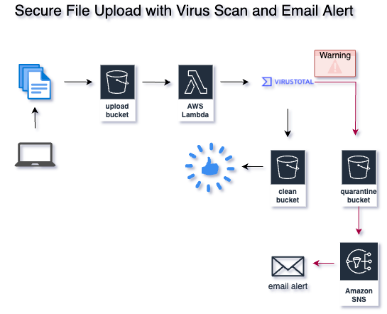

# Secure File Upload & Virus Scan (AWS + Lambda + VirusTotal)

This project is a serverless, secure file upload system that automatically scans uploaded files for malware using [VirusTotal](https://www.virustotal.com), routes them to the appropriate S3 bucket (clean or quarantine), and notifies stakeholders of infected files via Amazon SNS.

It is fully automated using Terraform and deployed through GitHub Actions.  
Ideal for organizations needing to safely accept file uploads and perform malware analysis with zero infrastructure management.

---

# Architecture Overview

---

# Features

- 📥 Upload files to a monitored S3 bucket
- 🔍 Automatically scan files using VirusTotal's public API
- ⚖️ Based on scan result, move files to a clean or quarantine bucket
- 📣 Trigger email alerts (SNS) when a threat is detected
- 🔐 Secured with S3 encryption, versioning, and lifecycle rules
- 🛠 Infrastructure-as-Code with Terraform
- 🌀 CI/CD via GitHub Actions

---

# Technologies Used

- AWS Lambda** (Python runtime)
- Amazon S3 (upload, clean, quarantine)
- Amazon SNS (email alerting)
- VirusTotal API v3
- Terraform
- GitHub Actions (CI/CD)

---

# Infrastructure as Code (IaC)

All infrastructure is defined in Terraform:

| Component | Description |
|----------|-------------|
| s3.tf | Upload, clean, and quarantine buckets (encrypted, versioned) |
| lambda.tf | Lambda function with VirusTotal integration |
| iam.tf | IAM roles and policies (least privilege) |
| sns.tf | SNS topic and email subscription |
| security-secrets.tf | VirusTotal API key (stored securely) |
| backend.tf | Remote state (S3 + DynamoDB locking) |
| outputs.tf | Exposes key infrastructure outputs |
| variables.tf | Centralized, reusable configuration |

---

# Continuous Deployment with GitHub Actions

GitHub Actions runs on push to `main`, automatically:

1. Installs Terraform
2. Injects secrets securely (VirusTotal API key, email address)
3. Runs terraform init, plan, and apply

Secrets like AWS_ACCESS_KEY_ID, VIRUSTOTAL_API_KEY, and ALERT_EMAIL are stored in GitHub Secrets.

---

## 🧪 How to Test It

1. Upload a test file (.zip) to your upload S3 bucket:
   
   aws s3 cp eicar.zip s3://secure-upload-bucket-name/

Monitor:

CloudWatch Logs for Lambda execution

SNS email inbox for threat alerts

S3 clean/quarantine buckets for file routing

To generate a test virus detection, upload the EICAR test file.

✅ Security Best Practices

S3 Encryption (SSE-S3)

Bucket Versioning

Quarantine Auto-Deletion (Lifecycle Policy)

Secrets managed via GitHub + optional AWS Secrets Manager

IAM roles with least privilege

No plaintext secrets in code or state

🔮 Future Enhancements

Store scan results in DynamoDB for audit trail

Add Slack or Microsoft Teams webhook notifications

Use KMS for envelope encryption

Add front-end upload dashboard

👨‍💻 Author

Jason Martinez
GitHub: @JMARZ369

📄 License

MIT License

Copyright (c) 2025 Jason Martinez

Permission is hereby granted, free of charge, to any person obtaining a copy
of this software and associated documentation files (the "Software"), to deal
in the Software without restriction, including without limitation the rights
to use, copy, modify, merge, publish, distribute, sublicense, and/or sell  
copies of the Software, and to permit persons to whom the Software is  
furnished to do so, subject to the following conditions:

The above copyright notice and this permission notice shall be included in  
all copies or substantial portions of the Software.

THE SOFTWARE IS PROVIDED "AS IS", WITHOUT WARRANTY OF ANY KIND, EXPRESS OR  
IMPLIED, INCLUDING BUT NOT LIMITED TO THE WARRANTIES OF MERCHANTABILITY,  
FITNESS FOR A PARTICULAR PURPOSE AND NONINFRINGEMENT. IN NO EVENT SHALL THE  
AUTHORS OR COPYRIGHT HOLDERS BE LIABLE FOR ANY CLAIM, DAMAGES OR OTHER  
LIABILITY, WHETHER IN AN ACTION OF CONTRACT, TORT OR OTHERWISE, ARISING FROM,  
OUT OF OR IN CONNECTION WITH THE SOFTWARE OR THE USE OR OTHER DEALINGS IN  
THE SOFTWARE.

